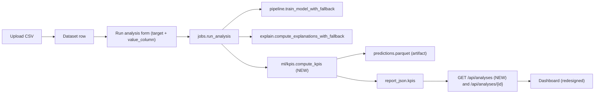

## Goals

The current `[Dashboard.tsx](frontend/src/pages/Dashboard.tsx)` only shows workspace stats (dataset count, total rows, recent uploads). Per-analysis ML output lives on `[AnalysisResult.tsx](frontend/src/pages/AnalysisResult.tsx)` but is purely descriptive ("which features matter") — never *prescriptive* ("how bad is it, what's at stake, what should I fix first").

A flat number like "₹12.4L at risk" is mid-level. The dashboard must answer **so what?** — i.e. prioritization-first:

- *Concentration*: "Top 18% of users hold 72% of the revenue at risk."
- *Counterfactual*: "Fixing the top 2 drivers can reduce churn by ~6.4% and recover ~₹3.1L."
- *Segment "so what?"*: "The Medium-risk segment holds 41% of revenue and is the easiest to fix."

We will:
- Persist per-row predictions, top-driver SHAP, and an optional monetary `value_column` so the backend can compute concentration, counterfactual, and tractability KPIs — not just totals.
- Compute a `kpis` block inside `report_json` covering all six categories below.
- Replace the Dashboard with a latest-analysis-driven KPI overview that works for both classification and regression.

Out of scope: changing `AnalysisResult.tsx` UI (it stays as the deep technical view), prescriptive action queues over time, multi-analysis trends.

## Data flow



## Backend changes

### 1. Persist `value_column` and predictions

- `[backend/app/schemas.py](backend/app/schemas.py)` `AnalysisCreate`: add optional `value_column: str | None`. Add a slim `AnalysisListItem` (id, dataset_id, dataset_name, target, task_type, status, created_at, completed_at, `kpi_summary` dict).
- `[backend/app/models.py](backend/app/models.py)` `Analysis`: add `value_column: Mapped[str | None] = mapped_column(String(512), nullable=True)`.
- New SQL migration `backend/sql/migration_003_add_value_column.sql`:
  ```sql
  ALTER TABLE analyses ADD COLUMN value_column VARCHAR(512) NULL;
  ```
  Also append the column to `[backend/sql/mysql_init.sql](backend/sql/mysql_init.sql)`.

### 2. New module `backend/app/ml/kpis.py`

Pure function `compute_kpis(df, target, task_type, fitted_pipeline, label_encoder, shap_rows, shap_matrix, shap_base_value, feature_names, raw_feature_columns, metrics, cv_metrics, value_column, artifact_dir, positive_class=None) -> dict`.

It scores the cleaned full dataframe (or a sample up to `MAX_SHAP_SAMPLES=1000` re-projected to the population for counterfactuals) via `fitted_pipeline.predict` / `predict_proba`, writes `artifact_dir / "predictions.parquet"` with columns `[__pred, __proba_pos, __expected_loss, __value, __top_driver_shap_1..k, target]`, and returns:

- **target_level**: `n_users`, `target_rate` (or `target_mean`), `predicted_target_rate` (or `predicted_mean`), `high_risk_count` (proba ≥ 0.7 for classification; top quartile for regression), `high_risk_share`.
- **impact_revenue** (only when `value_column` provided): `total_value`, `revenue_at_risk`, `potential_revenue_saved`, `avg_value_high_risk`.
- **concentration** (the "so what" headline) — Pareto over **expected loss** (`proba × value` for classification, `predicted_value × value` for regression; falls back to proba alone when `value_column` is missing):
  - `lorenz_points`: `[{x: 0.05, y: 0.32}, {x: 0.10, y: 0.51}, {x: 0.20, y: 0.72}, {x: 0.50, y: 0.94}]` for the curve.
  - `headline`: `{ top_pct_users: 0.20, share_of_risk: 0.72 }` — picked as the smallest `x` whose `y ≥ 0.7`, falling back to `x = 0.20`.
  - `gini`: 0–1 inequality coefficient on expected loss.
- **risk_segments** — 3-bucket distribution (`low <0.3`, `medium 0.3–0.7`, `high ≥0.7`) with **value share + tractability**:
  - `count`, `share` (of users), `value` and `value_share` (% revenue in segment).
  - `avg_proba`, `avg_top_driver_leverage` = mean `|shap_top|` of users in this bucket.
  - `tractability_score` = `avg_top_driver_leverage × bucket_size × (1 − avg_proba)` so that high-revenue, top-driver-sensitive, but-not-already-doomed segments score highest.
  - `easiest_to_fix: bool` flag set on the bucket with the highest `tractability_score`.
  - Regression mirrors this via predicted-value quartiles.
- **drivers**: top 5 by `mean_abs_shap` with `share = mean_abs_shap / Σ mean_abs_shap`, plus `top_driver_share`.
- **driver_impact** (counterfactual projection — the "fixing top 2 drivers reduces churn by ~X" KPI):
  - For each of the top 5 drivers, simulate "neutralizing" the driver by setting its per-row SHAP contribution to 0 and recomputing predicted proba via inverse-logit (classification) or raw sum (regression). Compute:
    - `delta_target_rate`: drop in predicted-positive rate (or mean).
    - `users_savable`: count of rows that flip from high-risk to low-risk.
    - `revenue_recoverable`: Σ `value × (proba_before − proba_after)` over saved/affected rows.
  - Plus aggregate roll-ups: `top1_*`, `top2_*`, `top3_*` so the UI can say *"Fixing the top 2 drivers can reduce churn by 6.4% and recover ₹3.1L."*
  - Labelled `approximation: "shap_zeroing"` and the UI must surface "estimate" wording so we don't overclaim causality.
- **reliability**: `score`, `tier` ∈ `{high, medium, low}`, `headline_metric` (e.g. `roc_auc` or `r2`), `headline_value`, `cv_std`, plus a one-line plain-language hint (`"CV varies — drivers may shift on retraining."`).

Edge cases: when `predict_proba` is unavailable (e.g. ElasticNet regression), we still compute concentration from predicted values; counterfactual driver_impact uses raw SHAP shifts. If `value_column` is missing/invalid, concentration falls back to proba-only and impact_revenue is omitted. SHAP matrix availability: `compute_explanations` already runs SHAP; we extend it to *also* return the per-row SHAP matrix on the same `MAX_SHAP_SAMPLES` sample, plus the base value, so KPI counterfactuals don't double-compute SHAP. For population estimates we extrapolate per-user reductions by averaging within risk segment.

### 3. Wire into the job

In `[backend/app/jobs.py](backend/app/jobs.py)`:
- Read `analysis.value_column`, validate it exists and is numeric (warn otherwise).
- Extend `compute_explanations_with_fallback` to also return the per-row SHAP matrix and base value for the sampled rows (currently only aggregates by feature). Where SHAP is unavailable (e.g. linear-permutation fallback), `compute_kpis` falls back to the linear-share approximation `delta_rate ≈ driver_share × current_rate` and tags `approximation: "linear_share"`.
- After SHAP, call `compute_kpis(...)` and add `report["kpis"] = kpis`.
- Persist `analysis.value_column` if set.
- Wrap with try/except so a KPI failure does not fail the whole analysis.

### 4. API additions in `[backend/app/routers/analyses.py](backend/app/routers/analyses.py)`

- Update `create_analysis` to accept and store `value_column`, validating it is in the dataset's column list (and numeric per `columns_json` dtype) — return 400 on mismatch.
- Add `GET /api/analyses` for the current user (joins to datasets via `user_id`, ordered by `created_at desc`, returns `AnalysisListItem`s with the KPI summary lifted from `report_json["kpis"]`).
- Optional: `GET /api/analyses/{id}/predictions?limit=200&order=risk_desc` reads `predictions.parquet` for a future "high-risk users" table (ship the route, render in frontend later).

## Frontend changes

### 5. Types + API

- `[frontend/src/types.ts](frontend/src/types.ts)`: add
  ```ts
  export type AnalysisKpis = {
    target_level: { n_users: number; target_rate?: number; predicted_target_rate?: number;
                    target_mean?: number; predicted_mean?: number;
                    high_risk_count: number; high_risk_share: number }
    impact_revenue?: { total_value: number; revenue_at_risk: number;
                       potential_revenue_saved: number; avg_value_high_risk: number; currency?: string }
    concentration: {
      lorenz_points: { x: number; y: number }[]
      headline: { top_pct_users: number; share_of_risk: number }
      gini: number
    }
    risk_segments: {
      bucket: 'low'|'medium'|'high'
      count: number; share: number
      value?: number; value_share?: number
      avg_proba?: number; avg_top_driver_leverage?: number
      tractability_score: number
      easiest_to_fix: boolean
    }[]
    drivers: { feature: string; mean_abs_shap: number; share: number }[]
    top_driver_share: number
    driver_impact: {
      approximation: 'shap_zeroing' | 'linear_share'
      per_driver: { feature: string; delta_target_rate: number; users_savable: number; revenue_recoverable?: number }[]
      top1: { delta_target_rate: number; users_savable: number; revenue_recoverable?: number }
      top2: { delta_target_rate: number; users_savable: number; revenue_recoverable?: number }
      top3: { delta_target_rate: number; users_savable: number; revenue_recoverable?: number }
    }
    reliability: { score: number; tier: 'high'|'medium'|'low'; headline_metric: string; headline_value: number; cv_std?: number; hint: string }
  }
  ```
  Extend `AnalysisReport` with `kpis?: AnalysisKpis`. Add `AnalysisListItem` mirroring backend.

### 6. Dashboard redesign — `[frontend/src/pages/Dashboard.tsx](frontend/src/pages/Dashboard.tsx)`

Replace today's three "datasets / rows / latest upload" cards with a **prioritization-first layout**:

- **Header**: title "Business impact" + an analysis selector (dropdown of completed analyses, defaults to the latest). Falls back to the existing welcome/empty state if no completed analysis exists.
- **Headline insight strip** (the "so what?") — two large callout cards above everything else:
  1. **Concentration callout**: *"Top 18% of users hold 72% of revenue at risk."* Backed by `concentration.headline`. Mini Lorenz curve sparkline (Recharts area) on the right; hover shows other points (top 5 / 10 / 20 / 50%).
  2. **Counterfactual callout**: *"Fixing the top 2 drivers can reduce churn by ~6.4% and recover ₹3.1L."* Backed by `driver_impact.top2`. Includes a small "estimate" tag with a tooltip explaining the SHAP-zeroing approximation.
- **Section: Target level** (4 KPI cards) — `Target rate`, `Predicted rate`, `High-risk users`, `Total users`. Labels switch to `Target mean / Predicted mean / Top-quartile users` for regression.
- **Section: Impact & revenue** (3 KPI cards, hidden when `impact_revenue` is absent) — `Revenue at risk`, `Potential revenue saved`, `Avg value (high-risk user)`. Locale-aware compact formatting (`₹1.24L`, `$1.24M`).
- **Section: Risk segments** — Recharts horizontal stacked bar with **two stacks** (users vs revenue) so the eye sees that e.g. *high* is 12% of users but 41% of revenue. Each bucket tile shows: count, user-share, revenue-share, avg proba, and an **"Easiest to fix"** pill on the segment with `easiest_to_fix: true`, with one-liner explainer (`"High top-driver leverage and big enough revenue footprint."`).
- **Section: Top drivers + projected impact** — table-style card with one row per top driver: name, share of importance, projected `Δ target rate`, `users savable`, `revenue recoverable`. Sortable by recoverable revenue. Footnote labels the projection an estimate based on `driver_impact.approximation`.
- **Section: Model reliability** — single badge card (tier high/medium/low) + headline metric and CV std + the plain-language hint from `reliability.hint`.
- **Footer**: existing "How it works" + recent datasets list, pushed below.

### 7. New shared components

Under `frontend/src/components/kpi/`:
- `KpiCard.tsx` — label, big number, hint, optional delta/icon, color-tinted ring; reused across all sections.
- `ConcentrationCallout.tsx` — large headline with `top_pct` and `share_of_risk`, Lorenz mini-curve, plain-language sentence.
- `CounterfactualCallout.tsx` — large headline projecting Δ target rate and revenue recoverable for top-K drivers, with "estimate" tooltip.
- `RiskSegmentsChart.tsx` — Recharts dual stacked bar (users vs revenue) plus per-bucket tiles, including an `EasiestToFix` pill.
- `DriverImpactCard.tsx` — table of top drivers × (share, Δ rate, users savable, revenue recoverable), sortable.
- `ReliabilityBadge.tsx` — tier pill + metric + plain-language hint.

These mirror the existing UI primitives in `frontend/src/components/ui/` (Card, PageHeader) so styling stays consistent.

### 8. Analysis-creation form

In `[frontend/src/pages/DatasetDetail.tsx](frontend/src/pages/DatasetDetail.tsx)`:
- Add an **Optional value column** `<select>` next to the target dropdown (numeric columns only via `dtype` filter). Auto-pick a sensible default if the column name matches `monthly_charges|monthlycharges|arpu|revenue|mrr|value|ltv|lifetime_value` (case-insensitive).
- Include `value_column` in the `POST /datasets/{id}/analyses` body.

## Tests

`backend/tests/test_kpis.py` (new):
- Synthetic binary-classification df → asserts `kpis.target_level.target_rate` ≈ true rate, `risk_segments` sums to `n_users`, `drivers[0].share > 0`, reliability tier present.
- **Concentration sanity**: build a df where 10% of users hold ~90% of expected loss → assert `concentration.headline.top_pct_users ≤ 0.10` and `share_of_risk ≥ 0.85`; `gini` ≥ 0.7.
- **Counterfactual sanity**: a feature engineered to dominate predictions → assert `driver_impact.per_driver[0].delta_target_rate > 0.05` and that `top1` dominates `top2 − top1`.
- **Tractability flag**: synthesize a medium-bucket-heavy + driver-leveraged dataset → assert `risk_segments` element with `easiest_to_fix: true` is the medium bucket.
- Synthetic regression df with a `value_column` → asserts `revenue_at_risk` equals sum of `value_column` over top-quartile predicted rows.
- Missing/invalid `value_column` → KPIs still computed without `impact_revenue` and concentration falls back to proba-only.

## Documentation

Update `[README.md](README.md)` "Usage" step 3 to mention the optional value column and the new Dashboard KPI summary; add a one-liner about `migration_003_add_value_column.sql` under "Notes → Database migration".