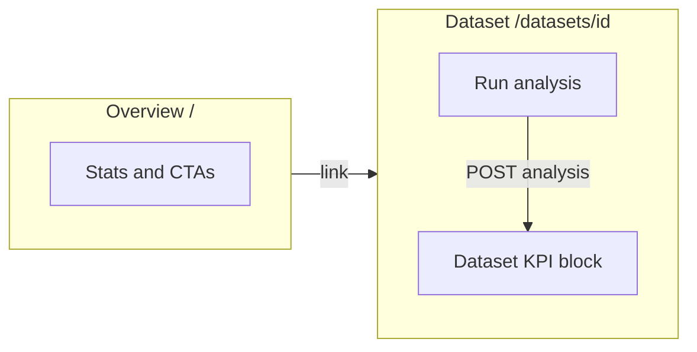

# Per-dataset business KPI dashboard

## Goal

Associate **every KPI/dashboard experience with one dataset**. When the user opens a dataset (**`/datasets/:id`**), they see KPIs driven only by **analyses for that dataset**. The global **Overview** (`/`) should no longer present a global “pick any analysis from anywhere” KPI cockpit ([`frontend/src/pages/Dashboard.tsx`](frontend/src/pages/Dashboard.tsx)).

## Current state

- [`GET /api/analyses`](backend/app/routers/analyses.py) returns **all** analyses for the user with `kpi_summary`; no dataset filter.
- [`Dashboard.tsx`](frontend/src/pages/Dashboard.tsx) wires the full KPI stack to a single global analysis selector (`useAnalysisList` + `useAnalysisDetail`).
- [`DatasetDetail.tsx`](frontend/src/pages/DatasetDetail.tsx) has schema, preview, and run form; **no KPI section**.

## Architecture (after change)

## 1. Backend: list analyses for one dataset

Add a dedicated route (clear ownership: “analyses under this dataset”):

- **`GET /api/datasets/{dataset_id}/analyses`** in [`backend/app/routers/datasets.py`](backend/app/routers/datasets.py) (or [`analyses.py`](backend/app/routers/analyses.py) if you prefer one file—**datasets.py** keeps symmetry with `POST /datasets/{id}/analyses`).

**Behavior:**

- Resolve `Dataset` by `dataset_id` and `user_id` (same 404 pattern as other dataset routes).
- Query `Analysis` where `Analysis.dataset_id == dataset_id`, order by `created_at` desc (match list ordering intent on the client).
- Return the **same shape** as the existing list endpoint: `list[AnalysisListItem]` with `kpi_summary` (reuse the builder from [`analyses.py`](backend/app/routers/analyses.py)—extract a small shared function if needed to avoid duplication).

**Tests:** extend or add a test in [`backend/tests/`](backend/tests/) that creates two datasets, analyses on each, and asserts the new route only returns rows for the requested dataset.

## 2. Frontend API + types

- In [`frontend/src/api.ts`](frontend/src/api.ts) (or wherever `listAnalyses` lives), add **`listDatasetAnalyses(datasetId: number)`** calling `GET /datasets/${datasetId}/analyses`.
- Reuse existing [`AnalysisListItem`](frontend/src/types.ts) typing.

## 3. Extract dataset-scoped KPI block

- Factor the **analysis-driven KPI UI** out of [`Dashboard.tsx`](frontend/src/pages/Dashboard.tsx) into a dedicated component, e.g. [`frontend/src/components/dataset/DatasetKpiDashboard.tsx`](frontend/src/components/dataset/DatasetKpiDashboard.tsx) (name flexible), with props:
  - `datasetId: number`
  - optional `datasetName?: string` for section title.
- Internals (mirror current dashboard logic, scoped only):
  - `useQuery(['datasetAnalyses', datasetId], () => listDatasetAnalyses(datasetId))`
  - Default selected analysis: **latest `status === 'completed'`** for this list (same sorting as today).
  - `useAnalysisDetail(selectedId)` unchanged.
  - Render the same KPI sections you already have (business impact, drivers, insights/recommendations, loading/empty states).
- Add a stable **`id`** on the section wrapper (e.g. `id="dataset-kpi-dashboard"`) for hash navigation from run completion or analysis page.

## 4. Mount on `DatasetDetail`

- Import and render **`DatasetKpiDashboard`** on [`DatasetDetail.tsx`](frontend/src/pages/DatasetDetail.tsx).
- **Placement:** after the “Run root-cause analysis” card (or immediately after preview if you prefer KPIs above the form—default recommendation: **below the run form** so configure → run → scroll to KPIs reads naturally). If you want KPIs visible without scrolling past the form, place the block **above** the run card instead (one product choice).

## 5. Slim global `Dashboard`

- Remove the **global analysis selector** and the **full KPI drill-in** that mixes all datasets.
- Keep high-level workspace content: e.g. dataset/analysis counts, recent uploads, **short copy** that business KPIs are under each dataset, and links/buttons to **`/datasets`** or recent dataset cards.
- Optionally show **one line per dataset** (e.g. “Latest completed analysis: …”) only if you add a small aggregate API later—**not required** for this task if it avoids scope creep.

## 6. Navigation polish (optional but low effort)

- When starting a run from [`DatasetDetail.tsx`](frontend/src/pages/DatasetDetail.tsx), after success you currently `navigate('/analyses/' + analysisId)`. Consider **`navigate(\`/datasets/${datasetId}#dataset-kpi-dashboard\`)`** (or append query `?highlight=analysis`) so the user lands on **that dataset’s KPI area** instead of only the standalone report—or keep both via a secondary “Open full report” link. Implement the minimal variant that fits your UX (hash scroll is enough without new routes).

## 7. Docs

- Short README note: business KPIs are **per dataset** on the dataset page; overview is workspace-level only.

## Files to touch (summary)

| Area | Files |
|------|--------|
| API | [`backend/app/routers/datasets.py`](backend/app/routers/datasets.py), possibly small helper in [`backend/app/routers/analyses.py`](backend/app/routers/analyses.py) |
| Tests | [`backend/tests/`](backend/tests/) (new or extended) |
| Client | [`frontend/src/api.ts`](frontend/src/api.ts), new `DatasetKpiDashboard.tsx`, [`DatasetDetail.tsx`](frontend/src/pages/DatasetDetail.tsx), [`Dashboard.tsx`](frontend/src/pages/Dashboard.tsx) |
| Docs | [`README.md`](README.md) (only if present in repo root) |

## Out of scope (unless you ask)

- Duplicate full KPI panels on **`/analyses/:id`** (AnalysisResult); a single “View KPIs on dataset page” link is optional.
