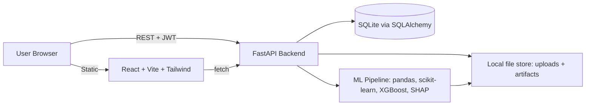

## Architecture



- Backend: FastAPI, SQLAlchemy 2.0, SQLite, JWT auth (python-jose + passlib/bcrypt), pandas, scikit-learn, xgboost, shap, pyarrow.
- Jobs: FastAPI `BackgroundTasks` (in-process) for local MVP; interface kept thin so it can later swap to Celery/RQ.
- Frontend: React + Vite + TypeScript + TailwindCSS + React Router + TanStack Query + axios + Recharts (feature importance / SHAP bars).
- Orchestration: `docker-compose.yml` with two services (`backend`, `frontend`) and mounted `./data` volume.

## Repository layout

```
rca/
  backend/
    app/
      main.py, config.py, db.py, models.py, schemas.py, auth.py, deps.py
      routers/{auth,datasets,analyses}.py
      ml/{pipeline,explain,insights,recommend}.py
    requirements.txt
    Dockerfile
  frontend/
    src/{main.tsx,App.tsx,api/client.ts,auth/AuthContext.tsx,pages/*,components/*}
    package.json, vite.config.ts, tailwind.config.js, Dockerfile
  docker-compose.yml
  README.md
  data/   (gitignored: uploads/, artifacts/, app.db)
```

## Backend specifics

- Models (`app/models.py`): `User(id, email, password_hash, created_at)`, `Dataset(id, user_id, name, filename, rows, cols, columns_json, created_at)`, `Analysis(id, dataset_id, target, task_type, status, metrics_json, artifacts_path, error, created_at, completed_at)`.
- Auth (`routers/auth.py`): `POST /auth/register`, `POST /auth/login` issuing JWT; `deps.get_current_user` guards all other routes.
- Datasets (`routers/datasets.py`):
  - `POST /datasets` multipart CSV/Parquet upload -> save to `data/uploads/{uuid}.{ext}`, read a preview with `pandas.read_csv(nrows=...)`, persist schema (dtype per column, null ratio, cardinality).
  - `GET /datasets`, `GET /datasets/{id}`, `GET /datasets/{id}/preview` (first 50 rows), `DELETE /datasets/{id}`.
- Analyses (`routers/analyses.py`):
  - `POST /datasets/{id}/analyses` body `{target, test_size?, max_rows?}` -> creates `Analysis(status=queued)`, schedules `BackgroundTasks.run_analysis` and returns id.
  - `GET /analyses/{id}` returns status + (when done) metrics + insights + recommendations + URLs to SHAP artifacts.
- ML pipeline (`app/ml/pipeline.py`):
  1. Load dataset, drop rows with null target.
  2. Auto-detect task: if target dtype is object/bool or numeric with <=20 unique values -> classification; else regression.
  3. Split features: numeric (median impute + standardize optional), categorical (most-frequent impute + one-hot, cap cardinality), via `ColumnTransformer`.
  4. Fit XGBoost (`XGBClassifier` / `XGBRegressor`) with sensible defaults, `train_test_split` with stratify for classification.
  5. Metrics: classification -> accuracy, f1, roc-auc (if binary); regression -> r2, mae, rmse.
- Explain (`app/ml/explain.py`): `shap.TreeExplainer(model).shap_values(X_test_sample)` (cap sample at ~1000 for speed); return per-feature mean |SHAP|, top-K feature importances, and a JSON-friendly summary (feature, mean_abs_shap, mean_signed_shap, direction). Save a PNG `shap_summary.png` via `shap.summary_plot(..., show=False)` + `plt.savefig`.
- Insights (`app/ml/insights.py`): rank features by mean |SHAP|; for top N compute correlation sign vs target (or mean SHAP sign) to phrase "higher X tends to increase/decrease {target}".
- Recommend (`app/ml/recommend.py`): rule-based templates keyed by (task_type, feature_kind, direction), e.g.
  - Numeric positive driver: "Consider strategies that increase `{feature}` since a 1-unit rise shifts predicted `{target}` by ~{avg_shap:.3f}."
  - Categorical level: "Category `{feature}={level}` is the strongest positive/negative driver; prioritize/mitigate accordingly."
  - Data-quality: if any feature null ratio > 30%, recommend backfilling.

## Frontend specifics

- `pages/Login.tsx`, `pages/Register.tsx`: email/password, stores JWT in `localStorage`, `AuthContext` injects `Authorization: Bearer` via axios interceptor.
- `pages/Dashboard.tsx`: list user datasets + "Upload" CTA.
- `pages/Upload.tsx`: drag-and-drop CSV/Parquet, progress bar, redirects to dataset detail.
- `pages/DatasetDetail.tsx`: schema table (col, dtype, nulls, uniques), preview table, target selector (with inferred task-type badge), "Run Analysis" button -> polls `GET /analyses/{id}` every 2s.
- `pages/AnalysisResult.tsx`:
  - Metrics card.
  - `FeatureImportanceChart` (Recharts horizontal bar of top 15).
  - `ShapSummary` (bars of signed mean SHAP + static `shap_summary.png` from backend).
  - `Recommendations` (numbered list of business-friendly bullets).
  - "Download report" (JSON) button.
- Tailwind-based clean layout, dark-mode ready, mobile-friendly.

## Dev + run

- `docker-compose.yml`: `backend` (uvicorn on 8000, mounts `./data`), `frontend` (vite dev on 5173, proxies `/api` to backend). Root `README.md` documents `docker compose up` and local non-Docker dev.
- `backend/requirements.txt` pins: fastapi, uvicorn[standard], sqlalchemy, pydantic, pydantic-settings, python-jose[cryptography], passlib[bcrypt], python-multipart, pandas, numpy, scikit-learn, xgboost, shap, matplotlib, pyarrow.
- CORS allowed for `http://localhost:5173` in dev.

## Scalability notes (built-in, not built-now)

- Job runner is isolated behind a `run_analysis(analysis_id)` function -> swap `BackgroundTasks` for Celery/RQ without API changes.
- File store uses a `Storage` abstraction (local now) -> later swap to S3 by implementing the same interface.
- SQLite connection is created via SQLAlchemy engine URL from env -> switch to Postgres by changing `DATABASE_URL`.