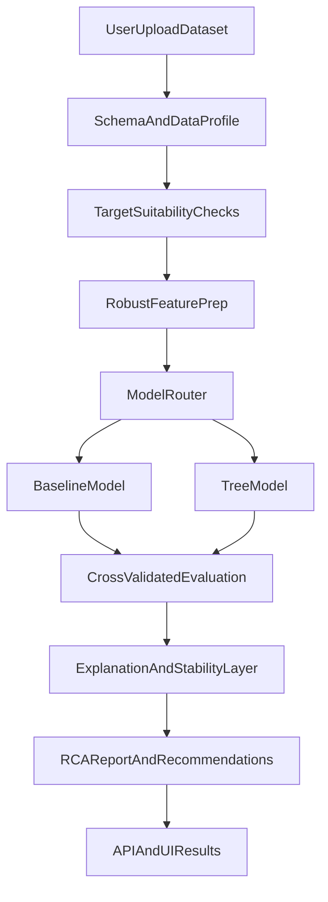

# Tabular RCA ML Stack Plan

## Goal
Build a stronger tabular RCA stack for this project where a user uploads a dataset, explicitly selects the target attribute to investigate, and receives reliable driver analysis for why that target is high, low, failing, or drifting.

## Current Baseline
The existing flow already matches the desired product entry point:
- Upload dataset in [frontend/src/pages/DatasetDetail.tsx](frontend/src/pages/DatasetDetail.tsx) and [backend/app/routers/analyses.py](backend/app/routers/analyses.py)
- Train a single XGBoost model in [backend/app/ml/pipeline.py](backend/app/ml/pipeline.py)
- Produce SHAP summaries in [backend/app/ml/explain.py](backend/app/ml/explain.py)
- Turn SHAP rankings into narrative insights in [backend/app/ml/insights.py](backend/app/ml/insights.py)
- Run the whole job in-process via `BackgroundTasks` in [backend/app/jobs.py](backend/app/jobs.py)

The main weakness is that the pipeline is still MVP-grade: `detect_task_type()` is heuristic-only, `_prepare_features()` is very simple, there is no dataset suitability gate, no model fallback strategy, no stability checks for edge cases, and the API/UI cannot distinguish strong explanations from low-confidence ones.

## Target Architecture

## Implementation Plan

### 1. Add a dataset profiling and suitability layer
Create a dedicated profiling module ahead of training so analyses fail early with useful messages instead of failing deep in the model code.

Scope:
- Add a new profiling/validation stage under `backend/app/ml/` that computes target cardinality, missingness, constant columns, leakage candidates, duplicated rows, high-cardinality categorical features, class imbalance, and row-count sufficiency.
- Extend [backend/app/routers/analyses.py](backend/app/routers/analyses.py) and [backend/app/jobs.py](backend/app/jobs.py) to run this gate before training.
- Surface structured warnings/errors through [backend/app/schemas.py](backend/app/schemas.py) and [frontend/src/pages/DatasetDetail.tsx](frontend/src/pages/DatasetDetail.tsx).

Why:
- This directly addresses current edge-case failures such as ID-like targets, sparse targets, unusable columns, and poor-quality uploads.

### 2. Replace the single-model path with a model router
Refactor [backend/app/ml/pipeline.py](backend/app/ml/pipeline.py) into a small training framework instead of one hard-coded XGBoost flow.

Scope:
- Keep XGBoost as one option, but add safer baselines first:
  - Classification: logistic regression / random forest baseline
  - Regression: elastic net / random forest baseline
- Route model choice by dataset shape: row count, feature count, class count, missingness, cardinality, and task type.
- Use sklearn `Pipeline` + `ColumnTransformer` for numeric/categorical preprocessing rather than manual matrix assembly only.
- Preserve the current `TrainResult` contract where possible so downstream API changes stay controlled.

Why:
- A routed stack is more robust than assuming one model family works for every uploaded dataset.

### 3. Strengthen evaluation and edge-case handling
Upgrade training from a single split to confidence-aware evaluation.

Scope:
- Add cross-validation or repeated holdout evaluation for small/medium datasets.
- Add explicit handling for severe class imbalance, tiny minority classes, near-constant targets, and low-sample regression targets.
- Return model quality metadata such as `confidence`, `validation_strategy`, `baseline_comparison`, and `data_warnings` through [backend/app/schemas.py](backend/app/schemas.py) and [backend/app/models.py](backend/app/models.py) if persistence is needed.
- Keep the user-facing result page in [frontend/src/pages/AnalysisResult.tsx](frontend/src/pages/AnalysisResult.tsx), but add quality badges and warnings when the result is weak.

Why:
- RCA is only useful if the model is trustworthy; today the UI shows metrics but not whether the explanation is stable enough to act on.

### 4. Make the explanation layer more reliable
Refine [backend/app/ml/explain.py](backend/app/ml/explain.py) and [backend/app/ml/insights.py](backend/app/ml/insights.py) so explanations are grouped, stable, and easier to trust.

Scope:
- Aggregate one-hot encoded features back to business columns consistently.
- Add directionality and segment-based summaries for the selected target state (for example, what differs in high-target vs normal-target rows).
- Add explanation stability checks across folds/samples so low-consistency drivers are marked as tentative.
- Keep SHAP for tree models, but support fallback importance/explanation paths for non-tree baselines.

Why:
- The current insights are narrative over SHAP rankings, but not yet resilient enough for messy real-world datasets.

### 5. Evolve the RCA report contract
Expand the analysis result returned by [backend/app/routers/analyses.py](backend/app/routers/analyses.py) and rendered in [frontend/src/pages/AnalysisResult.tsx](frontend/src/pages/AnalysisResult.tsx).

Scope:
- Add structured sections for:
  - dataset health summary
  - target suitability summary
  - chosen model and why it was selected
  - validation quality and confidence
  - top drivers grouped by original column
  - actionable recommendations with confidence levels
- Keep the current JSON download, but make it a richer report schema rather than raw MVP fields.

Why:
- A stronger ML stack needs a stronger output contract; otherwise the UI still looks confident even when the backend is uncertain.

### 6. Replace in-process jobs with a worker-friendly analysis pipeline
Promote [backend/app/jobs.py](backend/app/jobs.py) from FastAPI background work to a real async job layer.

Scope:
- Introduce a queue/worker design compatible with Redis + Celery/RQ or a lightweight equivalent.
- Keep the REST flow in [backend/app/routers/analyses.py](backend/app/routers/analyses.py), but move long-running analysis execution out of the web process.
- Track richer job status, progress, warnings, and retryable failures.

Why:
- A production ML stack will need reliability and isolation, especially when users upload large or dirty datasets.

### 7. Add focused test coverage around the failure modes
There are currently no visible tests in the repo, so the upgrade should include targeted backend tests instead of broad low-signal coverage.

Priority cases:
- ID-like target column rejection
- binary, multiclass, and regression routing
- high missingness and constant-column handling
- high-cardinality categorical compression
- tiny dataset rejection / low-confidence flagging
- explanation output shape and grouped-feature behavior

Suggested areas:
- `backend/tests/test_profile.py`
- `backend/tests/test_pipeline_routing.py`
- `backend/tests/test_explanations.py`
- `backend/tests/test_analysis_api.py`

## Key Files To Change
- [backend/app/ml/pipeline.py](backend/app/ml/pipeline.py): split into profiling, preprocessing, routing, training, evaluation
- [backend/app/ml/explain.py](backend/app/ml/explain.py): stable explanation interfaces and grouped outputs
- [backend/app/ml/insights.py](backend/app/ml/insights.py): richer RCA narratives tied to confidence and grouped drivers
- [backend/app/jobs.py](backend/app/jobs.py): orchestrate profile -> train -> explain -> persist
- [backend/app/routers/analyses.py](backend/app/routers/analyses.py): accept richer options and expose richer analysis responses
- [backend/app/schemas.py](backend/app/schemas.py): expand API contracts for warnings, confidence, and report sections
- [backend/app/models.py](backend/app/models.py): persist any new analysis metadata if needed
- [frontend/src/pages/DatasetDetail.tsx](frontend/src/pages/DatasetDetail.tsx): pre-run warnings and analysis options
- [frontend/src/pages/AnalysisResult.tsx](frontend/src/pages/AnalysisResult.tsx): confidence-aware RCA report presentation

## Delivery Order
1. Dataset profiling + suitability checks
2. Training pipeline refactor with model router
3. Evaluation/confidence metadata
4. Explanation/report contract upgrade
5. Worker-based execution
6. Focused regression tests

## Success Criteria
- Dirty or unsuitable datasets fail fast with clear guidance instead of vague backend errors.
- The system can handle classification and regression more reliably across small, imbalanced, sparse, and high-cardinality datasets.
- RCA output clearly separates strong findings from tentative ones.
- The API/UI report explains not just the top drivers, but also model confidence and dataset health.
- Analysis execution is reliable enough to scale beyond FastAPI in-process background tasks.