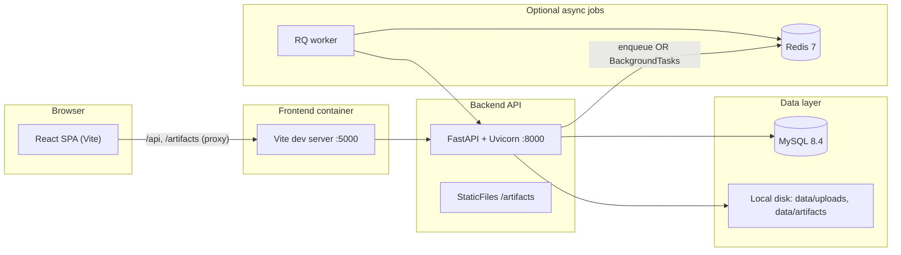

# RCA ML Platform — Architecture & Scalability

**Document scope:** End-to-end frontend, backend, and ML architecture; technology stack; and future scalability directions. Aligned with the codebase as of the document date.

---

## Table of contents

1. [Product overview](#1-product-overview)
2. [High-level system architecture](#2-high-level-system-architecture)
3. [Frontend architecture](#3-frontend-architecture)
4. [Backend architecture](#4-backend-architecture)
5. [ML and analytics architecture](#5-ml-and-analytics-architecture)
6. [Security and configuration](#6-security-and-configuration)
7. [Quality assurance](#7-quality-assurance)
8. [Technology and concepts glossary](#8-technology-and-concepts-glossary)
9. [Future scope: scalability](#9-future-scope-scalability)

---

## 1. Product overview

The **RCA ML Platform (MVP)** is a web application for **tabular root-cause-style analysis**. Users **register and log in**, **upload CSV or Parquet** datasets, select a **target column**, and receive:

- Model **metrics** (classification or regression)
- **Feature importance** and **SHAP-style explanations**
- **Narrative insights** and **rule-based business recommendations**
- A structured **JSON report** and an optional **SHAP summary image**

**Important framing (from product design):** outputs are **associative (model-based)** and are **not proven causal effects**. Domain judgment should accompany interpretation.

---

## 2. High-level system architecture

### 2.1 Component diagram



### 2.2 Request paths

| Path | Purpose |
|------|---------|
| `/api/*` | REST JSON API (auth, datasets, analyses, health) |
| `/artifacts/{analysis_id}/shap_summary.png` | Static serving of generated plots from the configured artifacts directory |

### 2.3 Deployment (Docker Compose)

Typical stack: **Redis**, **MySQL**, **backend (Uvicorn)**, **RQ worker** (same image as backend), **frontend** (Vite dev server in the bundled `frontend/Dockerfile`). Host directory **`./data`** is mounted for uploads and artifacts; MySQL uses a named volume for persistence.

---

## 3. Frontend architecture

### 3.1 Role

Single-page application: **authentication**, **dataset upload and listing**, **target selection and profiling**, **analysis orchestration**, and **polling plus visualization** of results.

### 3.2 Technology stack

| Layer | Technology |
|--------|------------|
| UI | **React 19** |
| Language | **TypeScript** |
| Build / dev | **Vite 5** (`@vitejs/plugin-react`) |
| Styling | **Tailwind CSS 4** via **`@tailwindcss/vite`** |
| Routing | **react-router-dom 7** (`BrowserRouter`, protected routes) |
| Server state | **TanStack React Query v5** (`QueryClientProvider`, `useQuery`, polling) |
| HTTP | **Axios** with **JWT** in `Authorization: Bearer` from `localStorage` |
| Charts | **Recharts** |
| Linting | **ESLint 9** + **typescript-eslint** + React hooks / refresh plugins |

### 3.3 Patterns

- **Shell:** `QueryClientProvider` → `AuthProvider` → `BrowserRouter` → routes under shared `Layout`.
- **Auth:** Login via `POST /api/auth/login`; token stored; `GET /api/auth/me` hydrates the user.
- **Protection:** Authenticated routes wrapped with a protected route component.
- **API client:** Axios `baseURL: '/api'`. Development **proxy** forwards `/api` and `/artifacts` to the backend (`VITE_BACKEND_URL` or default `http://127.0.0.1:8000`).
- **Long-running jobs:** Analysis detail view polls approximately every **2 seconds** until status is terminal.
- **UI:** Shared primitives (buttons, cards, headers, loading / empty / error states).

### 3.4 Concepts

SPA, client-side routing, JWT bearer authentication, TanStack Query caching and polling, Axios interceptors, Recharts, Tailwind utility-first styling, Vite dev server and environment loading.

---

## 4. Backend architecture

### 4.1 Role

REST API for authentication, dataset lifecycle, analysis orchestration, and static serving of generated artifacts.

### 4.2 Technology stack

| Concern | Technology |
|--------|------------|
| Web framework | **FastAPI** |
| ASGI server | **Uvicorn** |
| Validation / settings | **Pydantic v2**, **pydantic-settings** |
| ORM | **SQLAlchemy 2.x** |
| MySQL driver | **PyMySQL** (`mysql+pymysql://...`) |
| Password hashing | **passlib** (pbkdf2 default; bcrypt optional) |
| JWT | **python-jose** (HS256) |
| Uploads | **python-multipart** |
| Email in schemas | **email-validator** (with Pydantic `EmailStr`) |
| Tabular I/O | **pandas**, **numpy**, **pyarrow** |
| Job queue (optional) | **redis** + **RQ** |
| Testing | **pytest**, **httpx** |

### 4.3 API surface

- **`/api/auth`:** register, login, current user.
- **`/api/datasets`:** upload (multipart), list, get, preview, profile (target suitability), delete.
- **`/api` analyses:** create analysis on a dataset, get analysis by id, delete analysis.
- **`/api/health`:** health check.

### 4.4 Cross-cutting behavior

- **CORS** via `CORSMiddleware` (configurable origins).
- **Startup:** ensure data directories exist; create ORM tables (`create_all`) where applicable.
- **Dependencies:** database session per request; authenticated user resolved from Bearer JWT.

### 4.5 Persistence

- **MySQL:** users, datasets, analyses; JSON serialized in text columns (`columns_json`, metrics, insights, SHAP, report, etc.).
- **Files:** uploads under `data/uploads`; per-analysis artifacts under `data/artifacts/{analysis_id}/`.

### 4.6 Async execution

- If **`REDIS_URL`** is set: enqueue analysis jobs to **RQ**; worker runs the same pipeline as the API would inline.
- If unset: **FastAPI `BackgroundTasks`** runs analysis in-process.
- If enqueue fails: **fallback** to `BackgroundTasks`.

---

## 5. ML and analytics architecture

Orchestrated in **`run_analysis`**: load data → **profile** → **train (with fallbacks)** → **explain** → **insights** → **recommendations** → persist.

### 5.1 Data and task type

- Load **CSV** or **Parquet** with pandas.
- **Task detection:** classification vs regression via heuristics on the target column (`detect_task_type`).

### 5.2 Profiling

Before training, **profile** validates dataset and target: minimum rows, duplicates, nulls, high-cardinality or ID-like targets, class imbalance hints, regression variance, etc. Can **block** the run with clear errors; warnings feed the report.

### 5.3 Training pipeline

- **Preprocessing:** `sklearn` **Pipeline** + **ColumnTransformer**: numeric imputation + scaling; categorical imputation + **one-hot encoding** (with category limits).
- **Split:** train/test with stratification when valid for classification.
- **Cross-validation:** optional on the training fold (skipped in some fallback paths).
- **Model routing:** primarily **XGBoost** for larger / more complex cases; **Random Forest** or **Elastic Net** / **Logistic Regression** for smaller or simpler cases.
- **Metrics:** classification (accuracy, macro F1, optional ROC-AUC); regression (R², MAE, RMSE).
- **Confidence label:** heuristic `high` / `medium` / `low`.
- **Fallback training:** retries with simpler estimators and reduced CV if primary training fails.

### 5.4 Explainability

- **Tree models:** **SHAP TreeExplainer**; summary plot to PNG via **matplotlib** (Agg backend).
- **Linear models:** coefficient-based importance; optional **permutation importance** when compatible inputs exist.
- **Fallbacks:** native feature importances or uniform weights if SHAP fails.

### 5.5 Insights and recommendations

- **Insights:** rank by absolute contribution; aggregate one-hot columns to stem names; optional raw correlation; data-quality caveats.
- **Recommendations:** rule-based strings from drivers, metrics, validation strategy, confidence; explicit non-causal disclaimer.

### 5.6 Stored outputs per analysis

Status lifecycle (**queued → running → completed/failed**), plus JSON fields for metrics, insights, recommendations, SHAP rows, structured report, and artifact path.

---

## 6. Security and configuration

- Password hashing (**passlib**); JWT for API access (**HS256**).
- Config via environment / `.env`: `SECRET_KEY`, `DATABASE_URL`, `REDIS_URL`, CORS origins, data directories.

---

## 7. Quality assurance

- **`pytest`** suite under `backend/tests/` for pipeline, profiling, insights, etc.

---

## 8. Technology and concepts glossary

| Area | Items |
|------|--------|
| **Product** | Tabular ML, RCA-style (associative) analysis, classification/regression, feature importance, SHAP, recommendations, profiling, hold-out, cross-validation, imbalance, leakage hints |
| **Frontend** | React, TypeScript, Vite, Tailwind CSS 4, React Router, TanStack Query, Axios, JWT in localStorage, Recharts, ESLint |
| **Backend** | FastAPI, Uvicorn, Pydantic, SQLAlchemy, MySQL/PyMySQL, REST, multipart, JWT, CORS, static files, RQ, Redis, BackgroundTasks |
| **ML** | pandas, NumPy, scikit-learn (pipelines, preprocessing, CV, RF, linear models, permutation importance), XGBoost, SHAP, matplotlib |
| **Ops** | Docker, Docker Compose, MySQL 8.4, Redis 7, Python 3.12 (backend image), Node 20 (frontend image), volumes |

---

## 9. Future scope: scalability

This section describes **directions** for scaling the product beyond the current MVP. It assumes the same core stack unless noted.

### 9.1 Compute and API tier

**Current state:** One Uvicorn process per backend container; optional RQ workers for analyses.

**Future directions:**

- **Horizontally scale the API:** Multiple FastAPI replicas behind a load balancer (e.g. cloud LB + Kubernetes or ECS). Keep instances **stateless** (JWT already supports this).
- **Independent scaling:** Scale **API** and **worker** pools separately — workers follow **queue depth**; API follows request rate.
- **Queue evolution:** At higher throughput, consider **Celery**, **Arq**, or **managed queues** (SQS, Pub/Sub, Azure Service Bus) with **dead-letter queues** and **visibility timeouts** for long ML jobs.

### 9.2 ML workload isolation

**Current state:** Training and SHAP run in worker processes on shared CPU/RAM.

**Future directions:**

- **GPU pools** if you add heavier models (e.g. deep learning) or large-scale boosting.
- **Resource limits** per worker (CPU/memory) so one job cannot starve others.
- **Job cancellation** and **timeouts** exposed via API and UI.
- **Optional ML service split** only if organizational boundaries require it; otherwise keep a **modular monolith** with a clear `app/ml` boundary.

### 9.3 Data and storage

**Current state:** MySQL for metadata; **local filesystem** for uploads and artifacts.

**Future directions:**

- **Object storage** (S3, GCS, Azure Blob) for uploads and plots, with **pre-signed URLs** or CDN paths — required for **multi-instance** APIs and **geo-redundancy**.
- **Database:** Read replicas for read-heavy listing; **connection pooling** (e.g. RDS Proxy or equivalent for MySQL) under load.
- **Retention policies** for old analyses to control cost.
- **Optional analytics warehouse** if reporting and BI outgrow OLTP queries.

### 9.4 Caching and real-time updates

**Current state:** No HTTP caching; clients poll analysis status.

**Future directions:**

- Use **Redis** for **rate limiting**, **short-lived read cache** for hot `GET /analyses/{id}`, or token blocklists if needed.
- **WebSockets or SSE** for completion notifications to reduce polling traffic.

### 9.5 Multi-tenancy and product growth

**Current state:** Per-user ownership via `user_id`.

**Future directions:**

- **Organizations / teams**, shared datasets, **RBAC**.
- **Per-tenant quotas:** storage, concurrent jobs, max training rows.
- **Audit logs** for compliance (who ran which analysis on which data).

### 9.6 Observability and reliability

**Future directions:**

- **Centralized structured logging** (e.g. JSON → ELK, Datadog, CloudWatch).
- **Metrics:** latency, error rates, queue depth, job duration, worker restarts, OOM events.
- **Distributed tracing** (OpenTelemetry) across API → queue → worker.
- **Deep health checks:** database, Redis, object storage — not only `/api/health`.

### 9.7 Security and compliance at scale

**Future directions:**

- **Secrets management** (Vault, cloud secret stores).
- **Encryption at rest** for DB and object storage; enforce **TLS** end-to-end.
- **Data governance:** PII policies, **residency**, **right to erasure** workflows tied to storage and database records.

### 9.8 Frontend delivery

**Current state:** Vite dev server in Docker Compose is convenient for development; production typically uses a **static build**.

**Future directions:**

- **`npm run build`** artifacts served via **CDN** or reverse proxy with **cache headers** and **immutable hashed assets**.
- Keep API on a dedicated origin; cache only static assets.

### 9.9 ML lifecycle (value scalability)

**Future directions:**

- **Experiment tracking** (MLflow, Weights & Biases) for reproducibility across releases.
- **Scheduled retraining** or **batch scoring** for operational workflows.
- **Feature store** if many teams share features across datasets.

### 9.10 Summary

Near-term scaling builds on what exists: **queue-backed workers**, **stateless API**, and **Redis**. The largest structural step for multi-region and high availability is **object storage** instead of local disk, plus **observability** and **quotas**. Longer-term, **autoscaling workers** and **read replicas** address growth without rewriting the core ML pipeline.

---

## Document export

| Format | Location |
|--------|----------|
| **Markdown (source)** | `docs/ARCHITECTURE_AND_SCALABILITY.md` |
| **PDF (generated)** | `docs/ARCHITECTURE_AND_SCALABILITY.pdf` |

### Regenerating the PDF

From the repository root:

```bash
pip install markdown xhtml2pdf
python scripts/generate_architecture_pdf.py
```

This uses **Python**, **markdown**, and **xhtml2pdf** to produce an A4 PDF. Mermaid blocks appear as **plain code** in the PDF; for rendered diagrams, use a Markdown viewer that supports Mermaid (e.g. GitHub) or export from an editor.

**Alternatives:** Pandoc (`pandoc … -o …pdf` if a LaTeX or PDF engine is installed), **Print → Save as PDF** from the Markdown preview in your editor, or `npx md-to-pdf` (Chromium-based).
